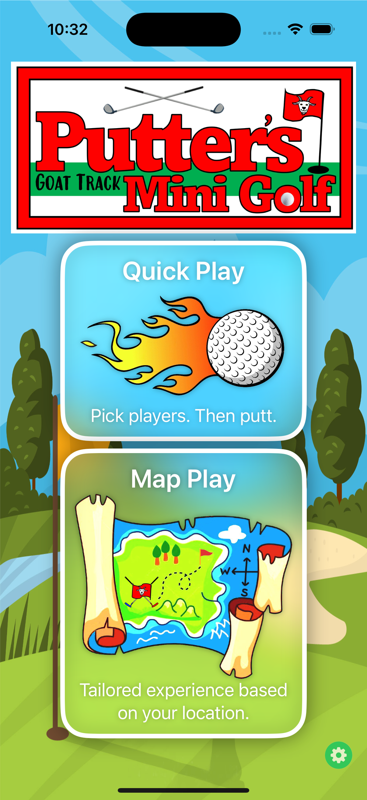
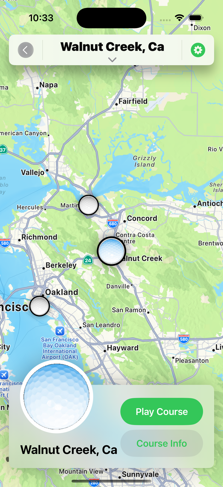
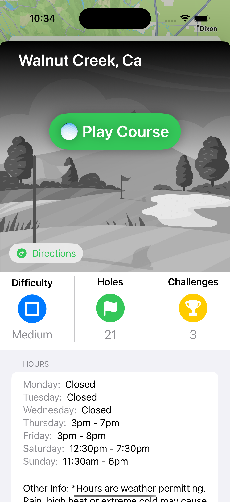
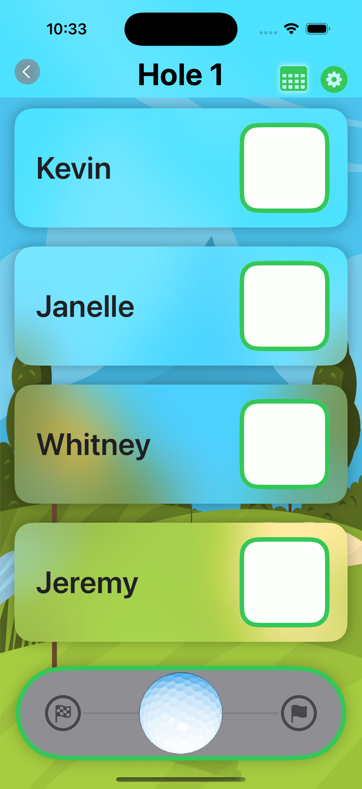
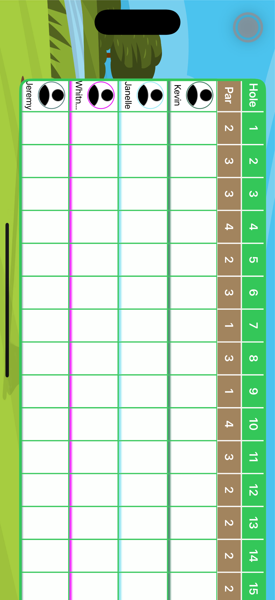

  

  # Putt Putt Golf Score Card

  ### A smart, playful scorecard app for real-world mini golf

  
  
  
  

---

## Overview

**Putt Putt Golf Score Card** is an iOS app that replaces the paper scorecard with something actually fun to use. Originally built for [Goat Track Putter's Mini Golf](https://www.putterscountryclub.com) in Walnut Creek, CA — a beloved handmade course with its own unique layout and scoring rules — the app is designed to make tracking strokes effortless so you can stay focused on the game.

Choose between **Quick Play** for a fast, no-fuss round with friends, or **Map Play** for a location-aware experience that surfaces nearby courses and loads their specific details automatically.

> 🚧 Currently in beta — not yet publicly available on the App Store.

---

## Screenshots

  
  &nbsp;
  
  &nbsp;
  
  &nbsp;
  
  &nbsp;
  

  Home · Map View · Course Detail · Score Entry · Full Scorecard

---

## Features

- 🏌️ **Two Play Modes** — **Quick Play** gets you straight to scoring in seconds. **Map Play** uses your location to surface nearby courses and load their details automatically.
- 📍 **Location-Based Course Discovery** — Browse mini golf courses near you on an interactive map with course-specific info including hole count, difficulty rating, challenges, and hours of operation.
- 👥 **Easy Multiplayer Setup** — Add all your players and track everyone's score simultaneously, hole by hole.
- 📋 **Full Scorecard View** — A clean, scrollable scorecard shows all holes, par values, and each player's running score at a glance.
- 🎨 **Playful Interface** — Bright, course-themed visuals designed to feel right at home on the green.

---

## Built With

- **Swift** — Native iOS development
- **SwiftUI** — UI framework
- **MapKit** — Location-based course discovery and map rendering
- **Xcode** — Primary IDE

---

## Contact

Have feedback or just want to say hello?

📬 [stuckbykev@gmail.com](mailto:stuckbykev@gmail.com)

---

## License

© 2024 Kevin Green. All Rights Reserved.

This project is not open source. No portion of this codebase may be reproduced, copied, modified, or distributed in any form without explicit written permission from the author.
